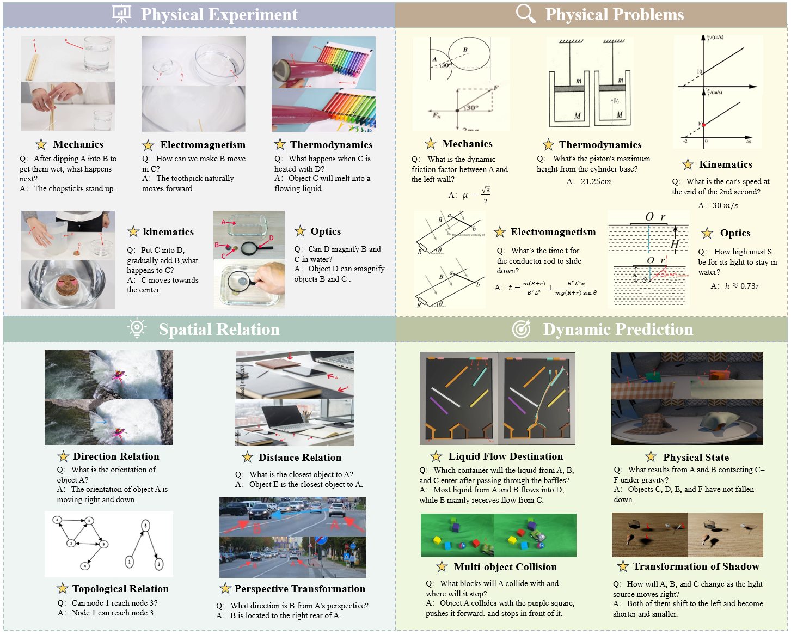

# MVPBench

<p align="center">
  
</p>

## Seeing is Not Reasoning: MVPBench for Graph-based Evaluation of Multi-path Visual Physical CoT

📘 [Homepage](https://csu-jpg.github.io/MVPBench/) | 🏆 Leaderboard | 🧑‍🔬 [Dataset](https://huggingface.co/datasets/CSU-JPG/MVPBench) |  📄 [MVPBench arXiv](https://arxiv.org/abs/2402.12345)

This repo contains the evaluation code for the paper:  
["Seeing is Not Reasoning: MVPBench for Graph-based Evaluation of Multi-path Visual Physical CoT"](https://arxiv.org/abs/2402.12345)

---

## 🔔 Updates

- **[2025-5-27]**: Our evaluation code is now available! 🌟  
- **[2025-5-22]**: Released MVPBench version 1.0 🔥

---
## 👁About MVPBench
Understanding the physical world—governed by laws of motion, spatial relations, and causality—poses a fundamental challenge for multimodal large language models (MLLMs). While recent advances such as OpenAI o3 and GPT-4o demonstrate impressive perceptual and reasoning capabilities, our investigation reveals these models struggle profoundly with visual physical reasoning, failing to grasp basic physical laws, spatial interactions, and causal effects in complex scenes. More importantly, they often fail to follow coherent reasoning chains grounded in visual evidence, especially when multiple steps are needed to arrive at the correct answer. To rigorously evaluate this capability, we introduce MVPBench, a curated benchmark designed to rigorously evaluate visual physical reasoning through the lens of visual chain-of-thought (CoT). Each example features interleaved multi-image inputs and demands not only the correct final answer but also a coherent, step-by-step reasoning path grounded in evolving visual cues. This setup mirrors how humans reason through real-world physical processes over time. To ensure fine-grained evaluation, we introduce a graph-based CoT consistency metric that verifies whether the reasoning path of model adheres to valid physical logic. Additionally, we minimize shortcut exploitation from text priors, encouraging models to rely on visual understanding.



<p align="center"><b>Overview of MVPBench.</b></p>

MVPBench consists of 1211 samples with a total of 4,701 images, covering both unique and repeated images. Each question and corresponding answer is distinct, underscoring the  broad range and depth of dataset across various physical reasoning scenarios.

---

## 📑 Table of Contents
- [Setup](#️-setup)
- [Accessing Datasets](#-accessing-datasets)
- [Data Format](#-data-format)
- [Evaluation](#-evaluation)
- [Citation](#-citation)
- [Contact](#-contact)


## ⚙️ Setup

To set up the environment for evaluation:

```bash
conda create -n MVPBenchEval python=3.10
conda activate MVPBenchEval
pip install -r requirements.txt
```

---

## 📂 Accessing Datasets

MVPBench was meticulously designed to challenge and evaluate visual physical reasoning through the lens of visual chain-of-thought (CoT) 
For more detailed information and accessing our dataset, please refer to our Huggingface page:

- 🧑‍🔬 [MVPBench](https://huggingface.co/datasets/CSU-JPG/MVPBench)

## 🗂 Data Format

- The dataset is provided in jsonl format and contains the following attributes:

```
[
    {
        "id": [string] Problem ID, e.g.,"PhyTest_0001",
        "query": [string] The question text,
        "original_scene": {
            "id": [string] original scene ID,
            "path": [string] The original image path of the question,
            "description": [string] Description of the original image content,
        },
        "key_step_1": {
            "id": [string] The first reasoning step ID,
            "path": [string] The first reasoning step image path of the question,
            "conclusion": [string] The textual content of the first reasoning step,
        },
        "key_step_2": {
            "id": [string] The second reasoning step ID,
            "path": [string] The second reasoning step image path of the question,
            "conclusion": [string] The textual content of the second reasoning step,
        },
		...
		"key_step_n": {
            "id": [string] The nth reasoning step ID,
            "path": [string] The nth reasoning step image path of the question,
            "conclusion": [string] The textual content of the nth reasoning step,
        },
        "final_scene": {
            "id": [string] The final answer ID,
            "path": The final answer image path of the question,
            "annotation": The textual content of the final answer,
        },
        "subject": [string] The subject of subset of data(Physics problems,Physics experiments, Spatial relations and Dynamic prediction,
        "possible_chains": [string] all possible reasoning paths, e.g., 
        [
            [ "key_step_1","key_step_2"]
        ],
        "json_path": [string] The path of the json file,
    }
]
```

---

## 🧪 Evaluation

Please refer to our evaluation folders for detailed information on evaluating with the MVPBench:

- 🔍 [MVPBench Evaluation](Evaluation/README.md)

---

---

## 📄 Citation

If you find our work useful, please cite us:

```bibtex
@article{dong2025mvpbench,
  title={Seeing is Not Reasoning: MVPBench for Graph-based Evaluation of Multi-path Visual Physical CoT},
  author={Dong, Zhuobai and Yi, Junchao and Zheng, Ziyuan and Han, haochen and Zheng, Xiangxi and Wang, Alex Jinpeng and Liu, Fangming and Li, Linjie and others},
  year={2025}
}
```

---

## 📬 Contact

For questions, suggestions or issues, feel free to open an [issue](https://github.com/CSU-JPG/MVPBench/issues) on GitHub.

---

